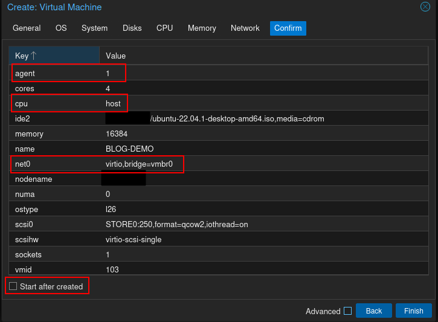
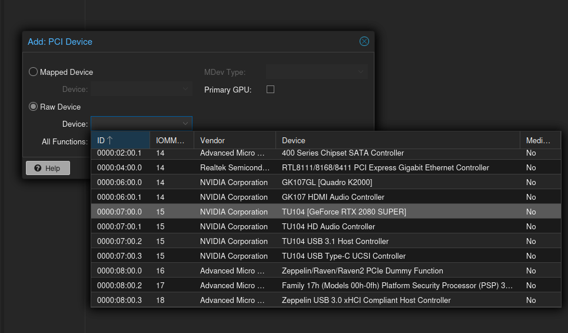
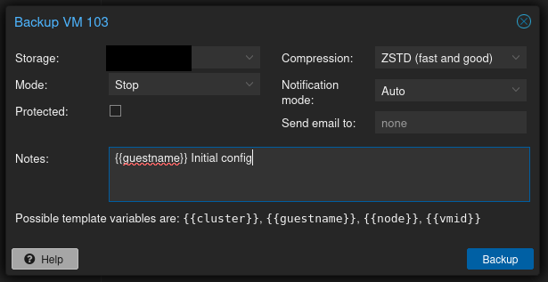

### Disclaimer

As with any technical documentation, there's a chance that it will be obsolete tomorrow. Additionally, I want to call out that this is not a step-by-step guide. There are a ton of great Proxmox install guides out there such as this one from [Craft Computing](https://www.youtube.com/watch?v=sZcOlW-DwrU) (great channel to follow, BTW). This is intended to provide some general guidelines and suggestions specific to building an AI lab at home. This is also not the "objectively best way possible", just suggestions from a home lab and GenAI enthusiast.

# Building an AI home lab with Proxmox

For over a decade now, I've been a major proponent of the home lab for IT professionals. Beyond the ability to self host services on the cheap, it's a great way to keep skills sharp, train at home for your next career move, and (most importantly) **break stuff without consequence**. 

## Why virtualization?
One of the most significant benefits to virtualization is backup functionality. At this point pretty much any mainstream virtualization platform has baked-in backup/ snapshot capability, and I cannot overstate how nice it is to be able to roll back to a known-good backup after mucking something up instead of re-imaging or having to un-muck the current install. Related, this also separates hosting these services from your main workstation, reducing the possibility of breaking something on the machine you need to develop on.

Beyond backups, we can build separate VMs for different projects that may have different dependencies and not worry about conflicts. Additionally, compared to running AI workloads on a laptop, we can take advantage considerably more powerful hardware.

## Hardware considerations

One of the nice things about building a home lab is that as far as hardware is concerned, pretty much anything will work (with a few exceptions). With the goal of adding GPU access to our workloads, there are a few features we require:

* CPU and mainboard must support virtualization
    * Pretty much everything but the most budget-oriented boards and processors have this functionality, but always double check. Intel and AMD support is VT-d and AMD-Vi respectively.
* CPU and mainboard must support IOMMU remapping
    * This is generally included with virtualization support, but double check to be sure
* CPU with integrated graphics
    * Since we're going to tie the GPU to a VM, and most consumer motherboards lack IPMI, I recommend getting a CPU with integrated graphics in case you need to troubleshoot something.
* RAM and storage - Beyond the official recommendations, I would have a few suggestions:
    * Proxmox recommends 2gb RAM for OS overhead, anything beyond that will depend on what you plan on doing with your VMs and how many you want running at the same time. 32gb dual-channel is a good (and cheap) place to start.
    * ECC ram is worth considering if it's in budget, but if you're just experimenting you can save money getting non-ECC
    * For storage drives, I would generally only buy solid state unless you're planning on using multi-terabyte datasets, but at that point you're probably looking at enterprise hardware or cloud hosting and getting away from home lab territory.
    * Separate VM disk storage from the host OS storage.
        * Just save future you some headache in the event you need to expand storage or otherwise replace a drive down the line.
    * Regarding ZFS and RAID
        * My suggestion is to consider how permanent your setup will be. Lots of folks in the homelab world will hem and haw about how ZFS and RAID are absolute necessities. If you just want to experiment and aren't going to lose sleep if a drive dies, you can save time and hardware skipping RAID and ZFS. If this is going to be used for some kind of serious research or you're going to host services long term, then the added hardware cost and configuration might be worth it.
    * Backup/ snapshot storage
        * Generally I suggest separating backup storage from your OS and VM storage for the same reason as keeping OS and VM separate. I had an existing NAS so that was an easy way to store backups, but in a pinch you could add a third disk to the host, or even use a USB drive.
        * Depending on how serious you want to be, you may also consider off-site backups.
* GPU
    * For CUDA applications, you're apparently spoiled for choice on which model cards support CUDA workloads from NVIDIA. That said, a major consideration is VRAM capacity so a GTX 1080 is probably the bottom end of practical use.
    * [While using AMD cards is technically possible, it requires some effort to get working and even then may not be stable.](https://pve.proxmox.com/wiki/PCI_Passthrough#GPU_passthrough)
    * If you didn't get a CPU with integrated graphics, you'll want a second GPU to use for the host. You can get pretty much anything as mainline linux has vast support these days. Ebay and other second hand market places are full of dirt cheap, single-slot GPUs that were shucked from enterprise workstations. We don't care about specs here, it just needs to drive a monitor in the event you run into trouble.
 
## VM Config

When creating VM's I suggest a few non-default options:

* Enable **Qemu Agent**
    * Required for a few features, such as allowing the host to shutdown/ restart the guest.
* Set CPU type to **host**
    * Enables some CPU features required for AI workloads that are not available on the virtualized CPU options (assuming the host CPU supports them)
* Disable **firewall**
    * Mostly personal preference, I leave this responsibility to my home firewall
* Uncheck **Start after created**
    * We need to assign the GPU to the VM so there's no point in starting it yet
 

### Adding GPU

Once the VM is created, navigate to the hardware tab, select **Add > PCI Device**. In the dialog, choose **Raw Device** then select the correct GPU from the list. 

**Note: be sure to select the parent device ending in .0**. 

Check the box to enable **All Functions** and then click **Add**. Keep in mind that while you can have multiple VMs with the same GPU added to them, only one can be powered on at a time.

### Last steps

At this point, fire up the VM and proceed with the guest OS install. Once complete, [install the qemu-guest-agent](https://pve.proxmox.com/wiki/Qemu-guest-agent) and shutdown the VM to let changes take effect (soft reboot will not allow changes to take effect).

Start the VM and navigate to the **Backup** tab. Verify the **Storage** drop down menu at the top right shows your intended backup target and select **Backup now**. I suggest adding a comment to the notes field to save yourself from having to guess what state the VM is in based solely on timestamps. Once you hit the **Backup** button the job will kick off starting with pausing/ stopping the VM. If your job stalls trying to shutdown the VM verify the qemu guest agent installed correctly.

I generally recommend creating a backup at major milestones such as completing software installs or configs so you have convenient rollback points

## Parting words

At this point we've got the basic framework setup to start working with GPU accelerated AI projects. I hope this helps streamline your projects!

# References

https://developer.nvidia.com/cuda-gpus
https://pve.proxmox.com/wiki/PCI(e)_Passthrough
https://www.proxmox.com/en/proxmox-virtual-environment/requirements
https://pve.proxmox.com/wiki/Qemu-guest-agent